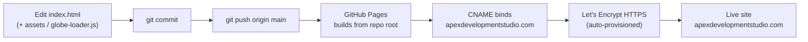
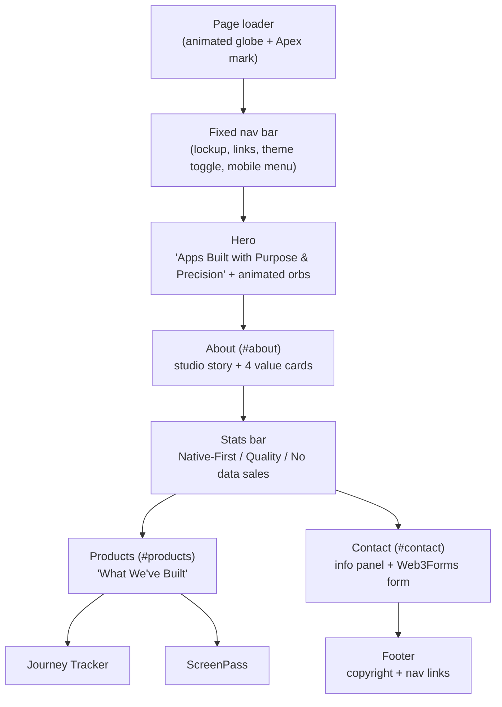

# Apex Development Studio LLC — Company Website

The official company website for **Apex Development Studio LLC**, an independent software studio crafting thoughtful, privacy-first applications. It is a single-page, dependency-free static site (`index.html` with embedded CSS + vanilla JS), hosted on GitHub Pages at a custom domain with a dark/light/system theme toggle, glass morphism, animated gradient orbs, and an animated globe page-loader.

> **Live site:** [https://apexdevelopmentstudio.com](https://apexdevelopmentstudio.com)
> **Repository:** [github.com/joemcmullin/ApexDevelopmentStudio](https://github.com/joemcmullin/ApexDevelopmentStudio)

---

## Deploy pipeline

GitHub Pages serves the repo root directly — there is no build step and no CI/CD workflow. Every push to `main` is published automatically (typically within ~60 seconds), and the `CNAME` file binds the site to the custom domain over auto-provisioned HTTPS.



---

## Page structure

A single-page layout with a fixed navigation bar and anchor-linked sections. An animated globe page-loader covers the screen until the page is ready, then reveals the content.



| Anchor | Section | Notes |
|--------|---------|-------|
| (top) | Hero | Tagline, mission, dual CTAs, two animated crimson/purple orbs (vibrant in dark mode) |
| `#about` | About | Studio story + four value cards: Privacy by Default, Native by Design, Thoughtful Craft, User-First Thinking |
| (inline) | Stats bar | Three metrics — 100% Native-First, 0 Compromises on Quality, 0 Third-Party Data Sales |
| `#products` | Products | "What We've Built" — **Journey Tracker** and **ScreenPass** product cards |
| `#contact` | Contact | Info panel + contact form (submits via Web3Forms) |
| (footer) | Footer | Copyright, studio name, nav links |

---

## Repository contents

```
ApexDevelopmentStudio/
├── index.html              # Complete single-page site (HTML + embedded CSS + JS)
├── globe-loader.js         # Animated globe page-loader logic
├── favicon.svg             # SVG favicon
├── Apex-mark.png           # Logo mark (used in the page loader)
├── apex-lockup.png         # Full lockup (used in the nav)
├── journeytracker-icon.png # Journey Tracker product icon
├── screenpass-icon.png     # ScreenPass product icon
├── CNAME                   # Custom domain: apexdevelopmentstudio.com
├── robots.txt              # Allow all crawlers; references sitemap
├── sitemap.xml             # Single-URL sitemap for SEO
├── _brand_assets/          # Source brand assets
├── Docs/                   # Internal docs (Docs/Roadmap.md is gitignored)
└── README.md               # This file
```

---

## Design & behavior

- **Theme system** — Light / Dark / System toggle in the nav. **Light is the default** (the inline anti-FOUC script defaults `localStorage['apex-theme']` to `'light'` before first paint). Tokens resolve via `:root` (light), `[data-theme="dark"]` (dark cinematic), and `prefers-color-scheme` for System.
- **Brand accent** — crimson (`#C0182E`) → purple (`#9B1DB5`) gradient on the hero title, primary buttons, nav CTA, and stat numbers.
- **Glass morphism** — value cards, product cards, the stats bar, and the form card use `backdrop-filter: blur()` in dark mode.
- **Animated orbs** — two CSS-keyframe orbs drift behind the hero (suppressed under `prefers-reduced-motion`).
- **Page loader** — animated globe + Apex lockup overlay shown until the page is ready (`globe-loader.js`).
- **Scroll animations** — below-the-fold elements reveal via `IntersectionObserver` with staggered delays.
- **Typography** — native system font stack (no external font requests).

---

## Technology

| Layer | Technology |
|-------|-----------|
| Markup | Semantic HTML5 |
| Styling | Embedded CSS with custom-property design tokens + `[data-theme]` |
| Scripting | Vanilla ES6 (inline + `globe-loader.js`) — no frameworks, no build tools |
| Animations | CSS `@keyframes` + `IntersectionObserver` |
| Theme persistence | `localStorage` + `data-theme` attribute (FOUC-free) |
| Contact form | **Web3Forms** (`POST https://api.web3forms.com/submit`) |
| Hosting | GitHub Pages (serves repo root, no CI) |
| Domain / SSL | Custom domain via `CNAME`; Let's Encrypt HTTPS auto-provisioned |
| SEO | Meta tags, Open Graph, JSON-LD `Organization`, `sitemap.xml`, `robots.txt` |

**Zero external runtime dependencies** beyond the Web3Forms submit endpoint — no npm, no bundler, no CDN, no tracking scripts. A Content-Security-Policy meta tag restricts loads to `'self'` and allows `connect-src` to `https://api.web3forms.com` for the form.

---

## Local development

No build step. Serve the folder with any static server:

```bash
cd /Users/joemcmullin/Projects/Sites/ApexDevelopmentStudio

# Python (built in)
python3 -m http.server 8765
# → http://localhost:8765

# or npx
npx serve .
```

Hard-refresh (`Cmd + Shift + R` / `Ctrl + Shift + R`) to bypass cache when testing changes.

---

## Publishing a change

```bash
cd /Users/joemcmullin/Projects/Sites/ApexDevelopmentStudio
git add index.html        # (+ any changed assets)
git commit -m "Describe the change"
git push                  # GitHub Pages publishes from main within ~60s
```

Before a meaningful content push:
- [ ] Update `sitemap.xml` `<lastmod>` to today's date
- [ ] Verify light mode (default) and dark mode (orbs, glass cards, gradient text)
- [ ] Check the responsive layout at mobile width

---

## Products

| Product | Description | Links |
|---------|-------------|-------|
| **Journey Tracker** | Native multiplatform GLP-1 therapy & weight-loss companion (iPhone, iPad, Mac) | [journeytracker.app](https://journeytracker.app) |
| **ScreenPass** | Parental control app — "a pass, not a prison" (iPhone) | — |

---

## Contact

| Purpose | Contact |
|---------|---------|
| General / business inquiries & support | support@apexdevelopmentstudio.com |
| Company website | [apexdevelopmentstudio.com](https://apexdevelopmentstudio.com) |

---

*© 2026 Apex Development Studio LLC. All rights reserved.*
